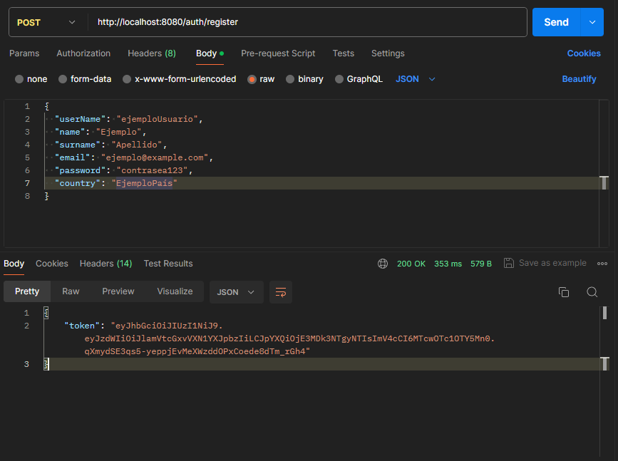
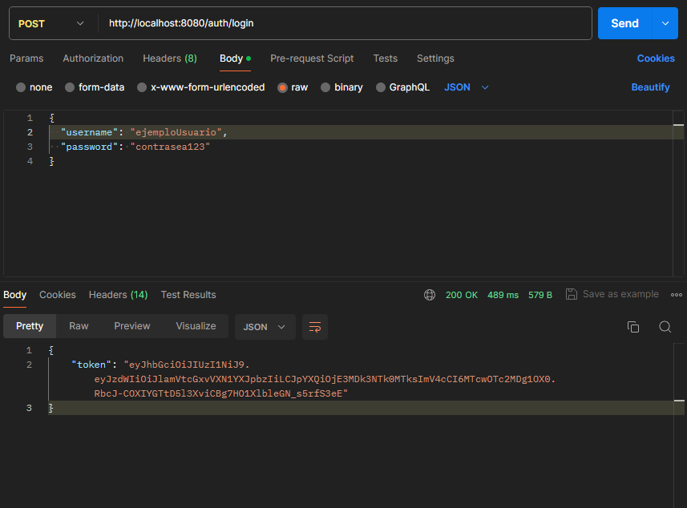
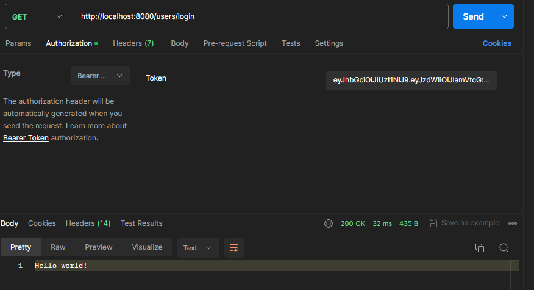
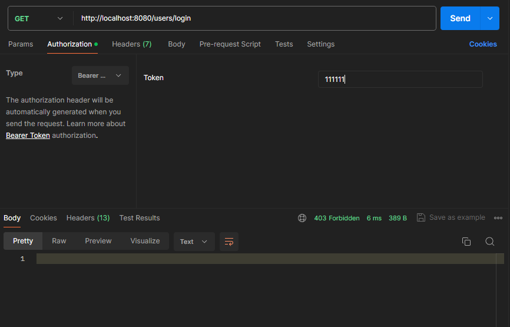

# ¡Bienvenido a gasto-compartido!

Este repositorio aloja una API diseñada con el propósito principal de servir como una plataforma para la práctica y mejora continua de mis habilidades en el desarrollo backend, centrándome específicamente en el dominio de Spring Boot, Java y la gestión de bases de datos.

## Objetivos Actuales:
* Conexión y Modelado de Base de Datos: Implementación de una estructura de base de datos eficiente y conectada, utilizando las mejores prácticas en diseño de bases de datos relacionales.
* Gestión de Usuarios con Spring Security: Registro seguro de usuarios y autenticación mediante Spring Security, garantizando la seguridad de la aplicación.
* Gestión de Gastos: Creación, visualización, edición y eliminación de gastos, junto con capacidades avanzadas de filtrado para facilitar la manipulación de datos.
* Categorización de Gastos: Funcionalidad para categorizar gastos, permitiendo la creación, edición y eliminación de categorías para una mejor organización.
* Resumen de Gastos por Usuario: Generación de un resumen detallado de los gastos totales de un usuario, con opciones de filtrado por período, como por ejemplo, un mes específico.
* Integración con API de Tasa de Cambio: Obtención de datos de tasa de cambio de una API pública, permitiendo la conversión de montos de gastos en caso de manejar múltiples monedas.
* Documentación con Swagger: Agregar Swagger para consultar todos los endpoints de la aplicación, y también probarlos inmediatamente en acción enviando una petición y recibiendo una respuesta.

Este proyecto es el resultado de mi pasión por la programación y mi compromiso personal con la mejora continua. Estoy emocionado de compartir este viaje de aprendizaje y desarrollo con la comunidad de desarrolladores backend.

## Creación de gastos a través de Swagger

Estoy en proceso de mejorar la experiencia de usuario mediante la implementación de Swagger. Con Swagger, tendrás acceso a una documentación clara y detallada que te guiará a través de cada paso del proceso de creación de gastos.

## Funcionalidades de Spring Security:

Se ha implementado un sistema de autenticación seguro utilizando Spring Security. A través del endpoint de registro, los usuarios recibirán un token que les permitirá iniciar sesión.

Una vez registrado, los usuarios podrán iniciar sesión utilizando sus credenciales. Si las credenciales son válidas, recibirán un token de acceso que les permitirá acceder a los endpoints de la aplicación <b>gasto-compartido</b>.

Además, se ha creado un endpoint para mostrar un mensaje "Hello World!" con un código de respuesta 200.

En caso de que ocurra un error, se devolverá un mensaje de error correspondiente.

Estas funcionalidades garantizan un acceso seguro a la aplicación y proporcionan una experiencia de usuario fluida.

## Crea tu primer Gasto:

Una vez que te hayas logeado y obtenido tu Token de acceso, puedes proceder a crear tu primer gasto siguiendo estos sencillos pasos:
1- Inicio de sesión: Ingresa tus credenciales para iniciar sesión en la plataforma y obtener el Token de acceso necesario para realizar operaciones.

2- Acceso al endpoint: Dirígete al endpoint correspondiente para crear el gasto e ingresa el Bearer Token que has obtenido durante el inicio de sesión.

3- Creación del gasto: Completa el cuerpo de la solicitud con la información necesaria, como el monto del gasto, la descripción y cualquier otro detalle relevante.

¡Felicidades! ¡Has creado tu primer gasto con éxito! Este proceso te permite registrar de manera eficiente tus gastos dentro de la plataforma. Si necesitas más ayuda o tienes alguna pregunta, no dudes en contactarme.

