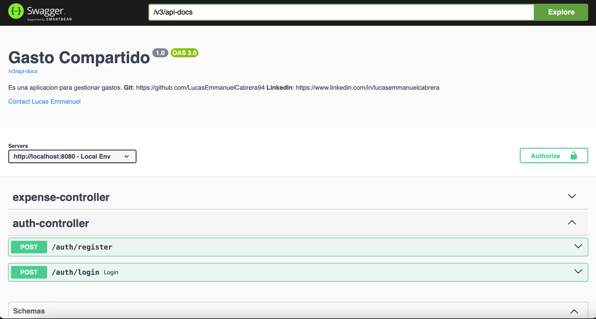

# ¡Bienvenido a gasto-compartido!

Este repositorio aloja una API diseñada con el propósito principal de servir como una plataforma para la práctica y mejora continua de mis habilidades en el desarrollo backend, centrándome específicamente en el dominio de Spring Boot, Java y la gestión de bases de datos.

## Objetivos Actuales:
* Conexión y Modelado de Base de Datos: Implementación de una estructura de base de datos eficiente y conectada, utilizando las mejores prácticas en diseño de bases de datos relacionales.
* Gestión de Usuarios con Spring Security: Registro seguro de usuarios y autenticación mediante Spring Security, garantizando la seguridad de la aplicación.
* Gestión de Gastos: Creación, visualización, edición y eliminación de gastos, junto con capacidades avanzadas de filtrado para facilitar la manipulación de datos.
* Categorización de Gastos: Funcionalidad para categorizar gastos, permitiendo la creación, edición y eliminación de categorías para una mejor organización.
* Resumen de Gastos por Usuario: Generación de un resumen detallado de los gastos totales de un usuario, con opciones de filtrado por período, como por ejemplo, un mes específico.
* Integración con API de Tasa de Cambio: Obtención de datos de tasa de cambio de una API pública, permitiendo la conversión de montos de gastos en caso de manejar múltiples monedas.
* Documentación con Swagger: Agregar Swagger para consultar todos los endpoints de la aplicación, y también probarlos inmediatamente en acción enviando una petición y recibiendo una respuesta.

Este proyecto es el resultado de mi pasión por la programación y mi compromiso personal con la mejora continua. Estoy emocionado de compartir este viaje de aprendizaje y desarrollo con la comunidad de desarrolladores backend.

## Swagger
Una vez que la levantes, podrás acceder fácilmente a nuestra documentación de API a través de Swagger. Aquí encontrarás una descripción detallada de todos los endpoints disponibles, junto con ejemplos de uso y detalles sobre los parámetros necesarios.

Acceso a Swagger
Para acceder a Swagger, simplemente sigue estos pasos:

* Inicia la aplicación.
* Abre tu navegador web favorito.
* Navega a la siguiente URL: http://localhost:8080/swagger-ui/index.html#

Listo, Ahora estarás listo para explorar y probar los diferentes endpoints de nuestra aplicación utilizando la interfaz intuitiva proporcionada por Swagger.

